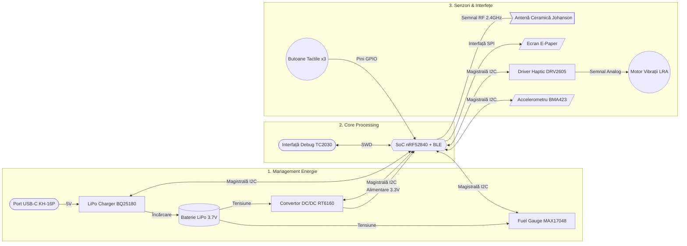

# proiectTSC
# InkTime Smart Watch

Acest proiect reprezintă designul hardware complet pentru un smartwatch bazat pe ecosistemul nRF52840, incluzând management avansat al bateriei, afișaj E-paper și feedback haptic.

## 1. Diagrama Bloc a Sistemului

Arhitectura proiectului este împărțită în 3 etaje principale: Input & Management Energie (Power), Unitatea Centrală de Procesare (Core MCU) și Interfețe Externe (Periferice și RF).

## 2. Componente principale și linkuri utile (BOM)
| Componenta | Link JLCPCB | DATASHEET |
| :--- | :--- | :--- |
| nRF52840 | [JLCPCB Search](https://jlcpcb.com/parts/componentSearch?searchTxt=nRF52840) | [Nordic Product Spec](https://docs.nordicsemi.com/bundle/ps_nrf52840/page/keyfeatures_html5.html) |
| BQ25180YBGR | [JLCPCB Search](https://jlcpcb.com/parts/componentSearch?searchTxt=BQ25180YBGR) | [TI BQ25180 datasheet](https://www.ti.com/lit/ds/symlink/bq25180.pdf) |
| RT6160AWSC | [JLCPCB Search](https://jlcpcb.com/parts/componentSearch?searchTxt=RT6160A) | [Richtek RT6160A datasheet](https://www.richtek.com/assets/product_datasheet/RT6160/DS6160-01.pdf) |
| MAX17048G+T10 | [JLCPCB Search](https://jlcpcb.com/parts/componentSearch?searchTxt=MAX17048) | [Analog/Maxim datasheet](https://www.analog.com/media/en/technical-documentation/data-sheets/MAX17048-MAX17049.pdf) |
| BMA423 | [JLCPCB Search](https://jlcpcb.com/parts/componentSearch?searchTxt=BMA423) | [BMA423 datasheet](https://www.bosch-sensortec.com/media/boschsensortec/downloads/datasheets/bst-bma423-ds004.pdf) |
| DRV2605YZFR | [JLCPCB Search](https://jlcpcb.com/parts/componentSearch?searchTxt=DRV2605) | [TI DRV2605 datasheet](https://www.ti.com/lit/ds/symlink/drv2605.pdf) |
| 2450AT18B100E | [JLCPCB Search](https://jlcpcb.com/parts/componentSearch?searchTxt=2450AT18B100E) | [Johanson antenna datasheet](https://www.johansontechnology.com/datasheets/2450AT18B100.pdf) |
| USBLC6-2SC6Y | [JLCPCB Search](https://jlcpcb.com/parts/componentSearch?searchTxt=USBLC6-2SC6Y) | [ST USBLC6-2 datasheet](https://www.st.com/resource/en/datasheet/usblc6-2.pdf) |
| KH-TYPE-C-16P | [JLCPCB Search](https://jlcpcb.com/parts/componentSearch?searchTxt=KH-TYPE-C-16P) | [KH-TYPE-C-16P datasheet](https://datasheet.lcsc.com/lcsc/2112101730_Kinghelm-KH-TYPE-C-16P_C2954157.pdf) |
| 5034802400 | [JLCPCB Search](https://jlcpcb.com/parts/componentSearch?searchTxt=5034802400) | [Molex 503480 datasheet](https://www.molex.com/p/molex/en-us/products/product-data-sheet?partNumber=5034802400) |

## 3. Descrierea funcționalității hardware

Proiectul a fost gândit să fie un dispozitiv portabil eficient energetic. 
* **Alimentarea** se face printr-un port USB-C (cu protecție ESD USBLC6), care intră în circuitul BQ25180 pentru a încărca bateria LiPo de 3.7V.
* **Monitorizarea** bateriei se realizează precis prin cipul MAX17048 (Fuel Gauge).
* **Tensiunea logică** a sistemului este coborâtă/urcată la 3.3V folosind regulatorul Buck-Boost RT6160, asigurând stabilitate indiferent de nivelul bateriei.
* **Procesarea** centrală este realizată de nRF52840, un SoC foarte capabil pe parte de BLE.
* **Perifericele** includ un modul IMU (BMA423) pentru gesturi și monitorizarea mișcării, un ecran E-Paper conectat prin SPI, 3 butoane tactile pentru navigare și un motor LRA controlat de driverul DRV2605 pentru feedback haptic. Toate cipurile inteligente comunică pe o magistrală comună I2C cu microcontrolerul.

*Nota de consum:* Cu bateria estimată la ~250-300mAh, folosind funcțiile de sleep profund ale nRF52840 (consum în repaus de aprox. 1.5µA) și ecranul E-Paper care consumă energie doar la refresh, autonomia teoretică depășește o săptămână în utilizare moderată.

## 4. Alocarea Pinilor (Pinout nRF52840) și Justificare

Microcontrolerul Nordic nRF52840 permite maparea flexibilă a interfețelor (I2C, SPI) pe majoritatea pinilor GPIO. Alocarea de mai jos a fost extrasă direct din schema proiectului și a fost gândită pentru a optimiza rutarea traseelor pe PCB, menținând integritatea semnalelor.

| Nume Pin nRF | Nume Semnal | Componentă | Interfață | Rol / Motivul alocării |
| :--- | :--- | :--- | :--- | :--- |
| **P0.05** | `SDA` | Magistrala Comună | I2C | Serial Data. Partajat între IC-urile de putere și senzori. |
| **P0.06** | `SCL` | Magistrala Comună | I2C | Serial Clock pentru sincronizarea comunicației I2C. |
| **P0.02** | `SCK` | Ecran E-Paper | SPI | Serial Clock. Rutat pentru a facilita un traseu direct către conectorul display-ului. |
| **P0.03** | `MOSI` | Ecran E-Paper | SPI | Master Out Slave In. Trimite datele de imagine către ecran. |
| **P0.04** | `EPD_CS` | Ecran E-Paper | SPI (CS) | Chip Select. Activează panoul e-ink pe magistrala SPI. |
| **P0.14** | `EPD_DC` | Ecran E-Paper | GPIO | Data/Command select. Comută între trimiterea de comenzi de configurare și pixeli efectivi. |
| **P0.15** | `EPD_RST` | Ecran E-Paper | GPIO | Reset hardware pentru panou. |
| **P0.16** | `EPD_BUSY`| Ecran E-Paper | GPIO (Int) | Semnal de intrare. Procesorul stă în sleep și este trezit când ecranul termină refresh-ul (devine LOW). |
| **P0.07** | `IMU_INT1`| BMA423 (IMU) | GPIO (Int) | Întrerupere principală. Trezește hardware MCU-ul la detecția mișcării (ex: ridicarea mâinii). |
| **P0.08** | `IMU_INT2`| BMA423 (IMU) | GPIO (Int) | Întrerupere secundară pentru procesarea avansată a gesturilor. |
| **P1.09** | `PMIC_INT`| BQ25180 (Charger)| GPIO (Int) | Întrerupere Power Management. Alertează sistemul la conectarea portului USB. |
| **P0.10** | `ALERT` | MAX17048 (Gauge)| GPIO (Int) | Întrerupere de la Fuel Gauge. Declanșată automat când bateria atinge pragul de "Low Battery". |
| **P0.11** | `HAPTIC_EN`| DRV2605 (Driver)| GPIO | Enable hardware. Taie complet alimentarea driver-ului de vibrații când nu este folosit, salvând energie. |
| **D- / D+** | `D- / D+` | Conector USB-C | USB | Pini dedicați hardware pentru comunicația USB 2.0 nativă. |
| **VBUS** | `VBUS` | Conector USB-C | Power | Pin de detecție voltaj. Informează hardware-ul când dispozitivul primește 5V extern. |
| **P0.18** | `RESET` | Interfață TC2030 | SWD | Pin hardware pentru resetarea procesorului din exterior via programator. |
| **SWDIO** | `SWDIO` | Interfață TC2030 | SWD | Pin dedicat pentru transferul bidirecțional de date în modul debug. |
| **SWDCLK**| `SWDCLK` | Interfață TC2030 | SWD | Clock-ul interfeței de programare. |
| **P1.00** | `SWO` | Interfață TC2030 | SWD | Serial Wire Output. Permite logging de mare viteză fără a întrerupe execuția codului. |
| **ANT** | `ANT` | Antenă Johanson | RF | Ieșirea fizică de 2.4GHz către filtrul de adaptare a impedanței. |
| **P0.00 / 0.01**| `XL1 / XL2`| Cristal 32.768kHz| XTAL | Conexiuni pentru oscilatorul de frecvență joasă, necesar pentru modulul RTC. |
| **XC1 / XC2** | `XC1 / XC2`| Cristal 32 MHz | XTAL | Conexiuni pentru oscilatorul principal, esențial pentru protocolul Bluetooth. |
| **[Pin?]**| `SW_UP` | Buton Tactil | GPIO | Intrare digitală pentru navigare (Pull-up intern). *[Completează cu pinul din schemă]* |
| **[Pin?]**| `SW_DN` | Buton Tactil | GPIO | Intrare digitală pentru navigare (Pull-up intern). *[Completează cu pinul din schemă]* |
| **[Pin?]**| `SW_ENT` | Buton Tactil | GPIO | Intrare digitală pentru selectare (Pull-up intern). *[Completează cu pinul din schemă]* |